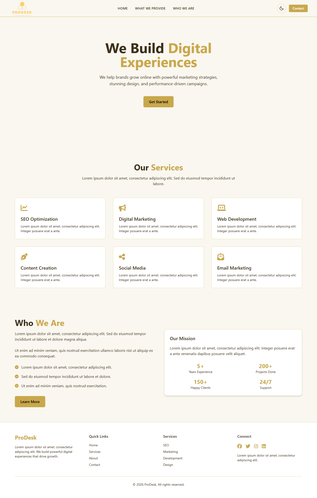
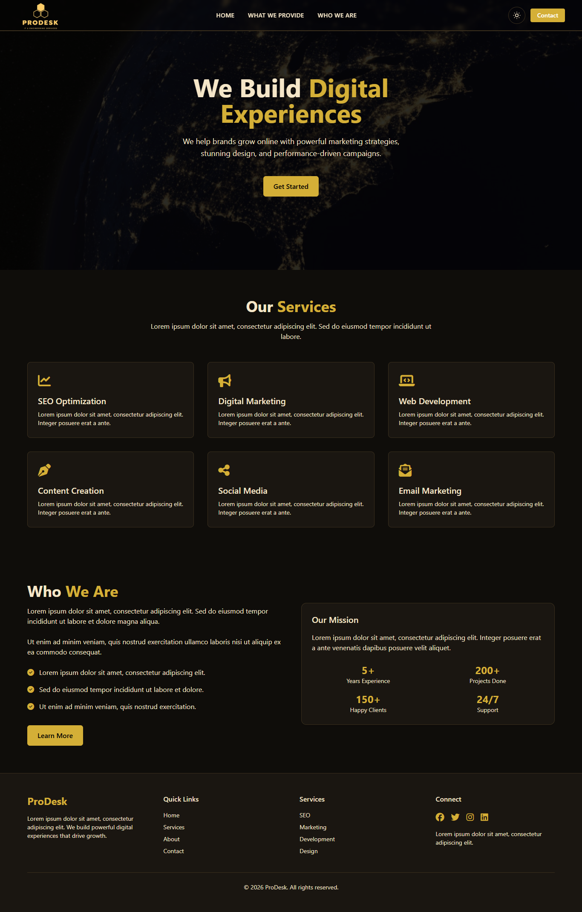

# Project Overview  
This project is a responsive website built using **HTML, Tailwind CSS, and JavaScript**. I have chosen **Level 3 difficulty**, focusing on creating a clean UI along with good performance and accessibility standards.  

The website represents a digital marketing and web development agency named **ProDesk**, with sections like Hero, What we offer, who are we, and Footer.

---

## Features  
- Fully responsive design (mobile, tablet, desktop)  
- Modern UI using Tailwind CSS  
- Dark mode support  
- Mobile navigation menu with toggle functionality  
- Optimized layout and smooth transitions  
- Clean and structured code  

---

## Technologies Used  
- **HTML5**   
- **Tailwind CSS (CDN)** 
- **JavaScript**  

---

##  Preview 
### Light Mode 
 

### Dark Mode

---

## Performance & Optimization  
During this project, I explored **Google Lighthouse** and learned how to improve:  

- ⚡ **Performance** – Optimizing images, reducing unused CSS, improving loading speed  
- ♿ **Accessibility** – Proper alt tags, semantic HTML, better contrast  
- 🔍 **SEO** – Meta tags, structured content, meaningful headings  

I worked towards achieving **high Lighthouse scores**, especially focusing on performance and accessibility improvements.

### Lighthouse scores

---

## Learning Experience  
This project gave me a very good hands-on experience. I learned:  

- Importance of **clean UI + performance together**  
- How to use Lighthouse reports and improve scores step by step  
- Small optimizations can make a big difference in real-world projects  

Overall, it was a great learning journey and helped me understand how real websites are optimized.

---

## Conclusion  
This project helped me improve both **frontend development skills** and **optimization techniques**. I enjoyed building this and learned many practical concepts which will be useful in future projects.

---

Thank you for checking out this project!